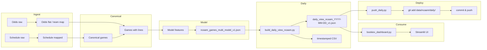
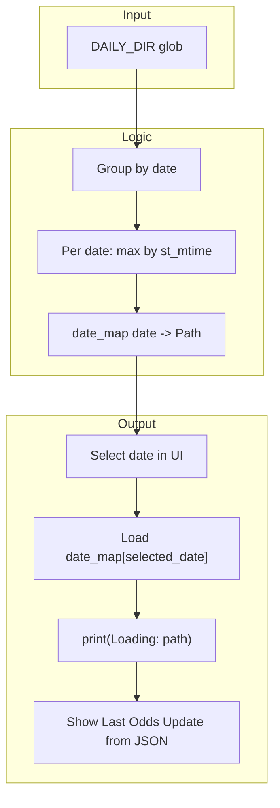
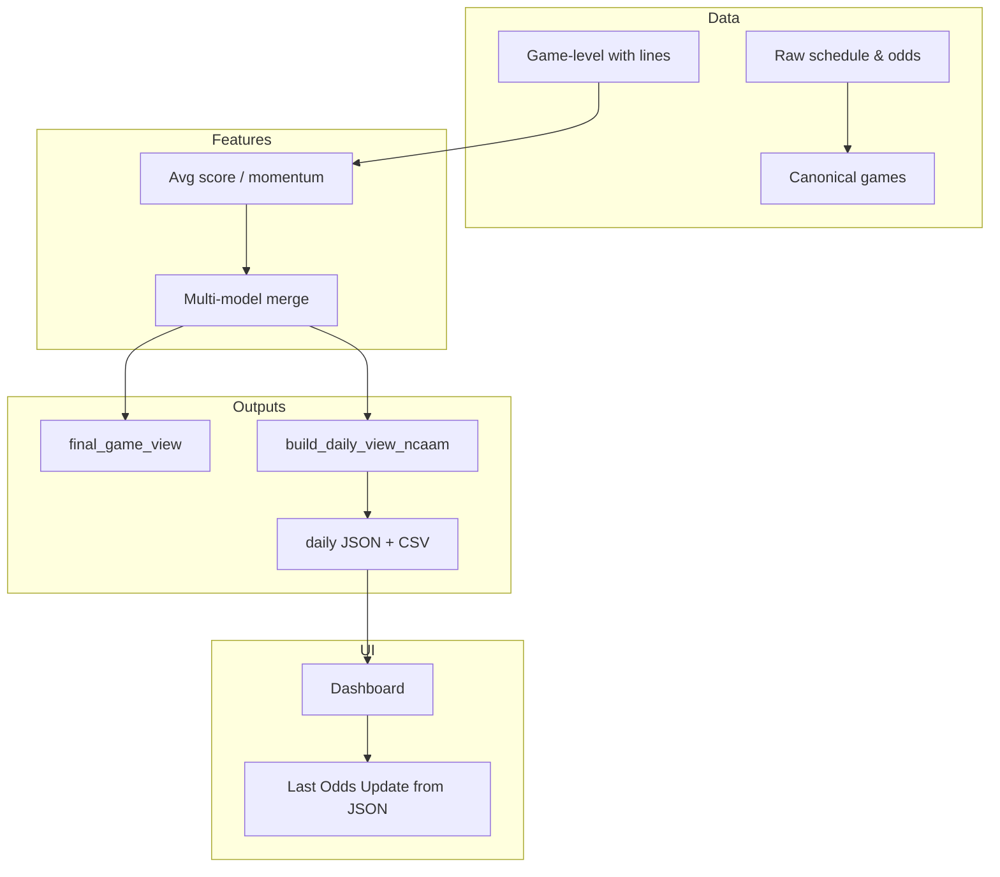

# BookieX pipeline diagrams

## NCAAM daily view flow

```mermaid
%% NCAAM Daily View & Dashboard (agentic work)
flowchart LR
    subgraph Ingest
        A[Schedule raw] --> B[Schedule mapped]
        C[Odds raw] --> D[Odds flat / team map]
    end
    subgraph Canonical
        B --> E[Canonical games]
        D --> F[Games with lines]
        E --> F
    end
    subgraph Model
        F --> G[Model features]
        G --> H[ncaam_games_multi_model_v1.json]
    end
    subgraph Daily
        H --> I[build_daily_view_ncaam.py]
        I --> J["daily_view_ncaam_YYYY-MM-DD_v1.json"]
        I --> K[timestamped CSV]
    end
    subgraph Consume
        J --> L[bookiex_dashboard.py]
        L --> M[Streamlit UI]
    end
    subgraph Deploy
        J --> N[push_daily.py]
        N --> O[git add data/ncaam/daily/]
        O --> P[commit & push]
    end
```

## Dashboard file selection (latest per date)

```mermaid
%% Dashboard: which file is loaded (latest mtime per date)
flowchart TD
    subgraph Input
        F[DAILY_DIR glob]
    end
    subgraph Logic
        F --> G[Group by date]
        G --> H[Per date: max by st_mtime]
        H --> I[date_map date -> Path]
    end
    subgraph Output
        I --> J[Select date in UI]
        J --> K["Load date_map[selected_date]"]
        K --> L["print(Loading: path)"]
        L --> M[Show Last Odds Update from JSON]
    end
```

## Pipeline overview

```mermaid
%% BookieX pipeline overview
flowchart TB
    subgraph Data
        D1[Raw schedule & odds]
        D2[Canonical games]
        D3[Game-level with lines]
    end
    subgraph Features
        D3 --> F1[Avg score / momentum]
        F1 --> F2[Multi-model merge]
    end
    subgraph Outputs
        F2 --> O1[final_game_view]
        F2 --> O2[build_daily_view_ncaam]
        O2 --> O3[daily JSON + CSV]
    end
    subgraph UI
        O3 --> U1[Dashboard]
        U1 --> U2[Last Odds Update from JSON]
    end
    D1 --> D2
```
